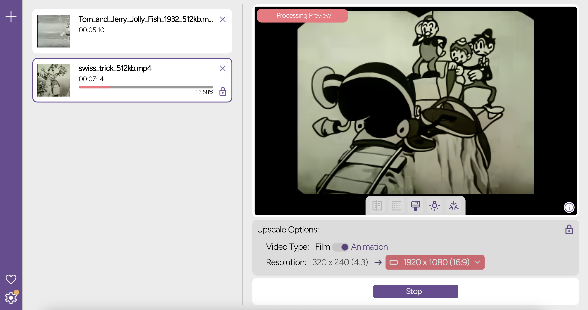

# Rewind - A Free AI Video Upscaler 

**Transform Your Video Memories for Free!**

Rewind is a free and powerful desktop application that uses **AI** to transform your low-resolution videos into high-quality videos. The project started to upscale my parents home videos so they will look good on a 4k TV.

---

## ✨ Key Features

| Feature | Description |
| :--- | :--- |
| **Truly Free & Unlimited** | Forget cloud services and monthly credits! Process an **unlimited** amount of videos directly on your own computer without any external server reliance. |
| **Ultra-High Resolution Upscaling** | Use advanced AI algorithms to instantly upscale your videos, with support for resolutions up to **8K** on compatible hardware. |
| **Local AI Power** | Leverages the full potential of your computer's **GPU and CPU** to deliver top-tier results without requiring high-end servers. |
| **Easy to Apply Filters** | Use built-in filters to specifically improve the quality of older videos, restoring them to high-definition vibrancy. |
| **Batch Processing** | Save time and effort by simultaneously batch processing multiple videos at the same time. |

---

## 🎥 See the Transformation

**Tom and Jerry: A Swiss Tricks** - *240p upscaled to 1080p*

---

## 💻 Download and Get Started

Rewind is a free cross-platform application supporting **Windows, macOS (comming soon), and Linux**.

➡️ [Download Rewind Now](https://rewind-app.xyz)

---

## ⚠️ System Requirements (FAQ Summary)

To ensure the best performance and compatibility, please note the following:

* **Graphics Card (GPU):** A **Vulkan-compatible** graphics card is required (Nvidia or AMD).
* **Apple Users:** Apple M-Series chips (M1, M2, M3, etc.)
* APUs are generally supported.
* **Integrated Graphics (iGPUs):** Integrated graphics units are **not recommended** due to insufficient performance.
* **Resource Usage:** While processing, the project folder can range from **2 GB to 100 GB** depending on the final output quality (1080p, 4K, etc.) as Rewind processes videos at a lossless quality.

---

## 🤝 Support and Contact

If you have any questions, run into bugs, or just want to show your support, you can reach out:

* **Email:** `rewind.develop@gmail.com`
* **Donate:** Your generosity allows for dedicated time to add new features and fix bugs.

  
